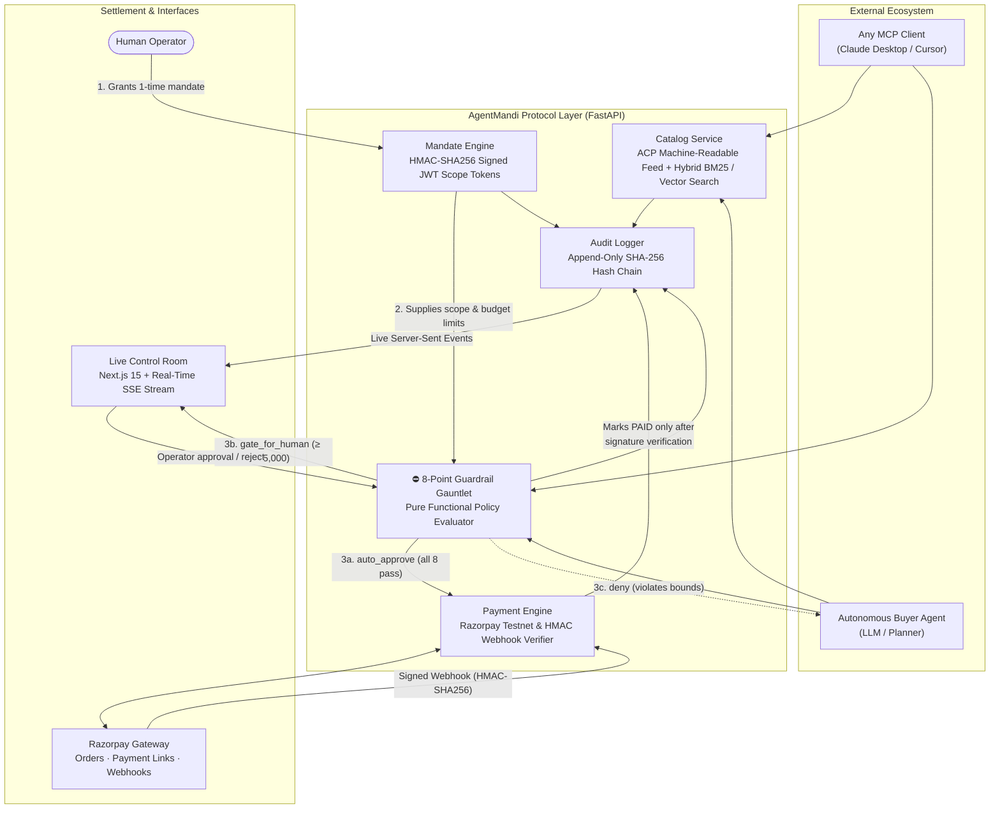

# AgentMandi

<div align="center">

```
   █████╗  ██████╗ ███████╗███╗   ██╗████████╗███╗   ███╗ █████╗ ███╗   ██╗██████╗ ██╗
  ██╔══██╗██╔════╝ ██╔════╝████╗  ██║╚══██╔══╝████╗ ████║██╔══██╗████╗  ██║██╔══██╗██║
  ███████║██║  ███╗█████╗  ██╔██╗ ██║   ██║   ██╔████╔██║███████║██╔██╗ ██║██║  ██║██║
  ██╔══██║██║   ██║██╔══╝  ██║╚██╗██║   ██║   ██║╚██╔╝██║██╔══██║██║╚██╗██║██║  ██║██║
  ██║  ██║╚██████╔╝███████╗██║ ╚████║   ██║   ██║ ╚═╝ ██║██║  ██║██║ ╚████║██████╔╝██║
  ╚═╝  ╚═╝ ╚═════╝ ╚══════╝╚═╝  ╚═══╝   ╚═╝   ╚═╝     ╚═╝╚═╝  ╚═╝╚═╝  ╚═══╝╚═════╝ ╚═╝
```

**Authorising The Machine — A Cryptographically Guarded Commerce & Mandate Layer for AI Agents**

[](https://fastapi.tiangolo.com)
[](https://nextjs.org)
[](https://python.org)
[](https://nodejs.org)
[](https://razorpay.com)
[](https://modelcontextprotocol.io)
[](LICENSE)

</div>

---

## Overview

**AgentMandi** transforms standard e-commerce and retail merchants into machine-discoverable, transactable endpoints for autonomous AI buyer agents. 

While conventional commerce pilots focus on embedding conversational chat widgets *inside* a merchant's storefront, **AgentMandi solves the inverse and fundamentally harder problem**: exposing a merchant's inventory and checkout infrastructure so that **any outside AI agent** can browse, negotiate, evaluate, and purchase under cryptographically signed human mandates—without the agent ever being trusted with private payment keys, unbounded wallets, or carte blanche authority.

```
Point any MCP-compliant agent (Claude Desktop, Cursor, Custom Agent) at this protocol,
and it can discover products, evaluate bounds, and execute payments under strict human mandates —
without a human touching the checkout, and with zero possibility of exceeding authorized bounds.
```

---

## Key Pillars & Invariants

| Principle | Technical Implementation | Proof & Verification |
| :--- | :--- | :--- |
| **Explainable Decisions** | Pure functional guardrail evaluation in `services/api/app/policy/engine.py`. | `GET /intents/{id}/decision` returns individual verdicts and human-readable reasons for all 8 checks. |
| **Deterministic Budget Bounds** | Signed HMAC-SHA256 JWT tokens encoding per-transaction ceilings, total budgets, and allowed categories. | Mandate meters on dashboard; forged tokens or tamper attempts fail signature checks before bounds are consulted. |
| **Human-in-the-Loop (HITL)** | High-value purchases (≥ ₹5,000 threshold) trigger `gate_for_human` state. | The operator reviews and waives the value threshold in the control room; background checks re-evaluate against real-time state. |
| **Tamper-Evident Audit Chain** | Append-only SQLite ledger chained via `sha256(prev_hash + canonical_json(event))`. | DB triggers block `UPDATE` and `DELETE`. `GET /audit/verify` confirms chain integrity or pinpoints broken sequences. |
| **Graceful Agent Recovery** | Machine-readable rejection payloads with explicit shortfall metrics. | The buyer agent re-plans inside the same execution run (e.g., searches for lower-priced alternatives when budget is exhausted). |
| **Universal Agent Compatibility** | 7 Model Context Protocol (MCP) tools operating over public HTTP APIs. | Any MCP-compliant client can discover products, verify mandates, and transact without proprietary SDKs. |

---

## Architectural Workflow



### The Ironclad Invariant
**Money moves only through the payment service, and only when the guardrail engine issues `auto_approve`.** The buyer agent is treated as an untrusted actor with zero direct access to merchant payment credentials or database writes.

---

## The 8-Point Guardrail Gauntlet

Every purchase intent evaluates against an ordered gauntlet of deterministic checks (`services/api/app/policy/engine.py`). Evaluation is executed as a **pure function** without external network dependencies, ensuring complete reproducibility from audit payloads.

```
[Intent] ──► (1) Mandate Valid? ──► (2) Merchant Match? ──► (3) Product & Price Valid? ──► (4) Category Allowed?
                  │                      │                         │                           │
                 FAIL                   FAIL                      FAIL                        FAIL
                  │                      │                         │                           │
                  ▼                      ▼                         ▼                           ▼
[DENIED] ◄──────────────────────────────────────────────────────────────────────────────────────┘
                  ▲                      ▲                         ▲                           ▲
                  │                      │                         │                           │
[Intent] ──► (5) Txn Cap Pass? ──► (6) Budget Available? ──► (7) Stock Available? ──► (8) Under High-Value Gate?
                                                                                               │
                                                                                           OVER LIMIT
                                                                                               │
                                                                                               ▼
                                                                                      [GATE_FOR_HUMAN]
```

| Sequence | Guardrail Check | Failure Condition | Security & Business Rationale |
| :---: | :--- | :--- | :--- |
| **01** | `mandate_valid` | Signature mismatch, expired timestamp, or revoked ID. | Guarantees the agent holds genuine, unexpired human consent. |
| **02** | `merchant_match` | Intent targets a merchant different from the mandate recipient. | Prevents token reuse across unauthorized third-party stores. |
| **03** | `product_exists` | SKU not found, invalid quantity, or **price != catalog price**. | **Crucial:** Prevents an agent from naming its own purchase price. |
| **04** | `category_allowed`| Product category is outside the authorized allow-list. | Restricts agent purchases strictly to permitted domains (e.g., office equipment). |
| **05** | `per_txn_cap` | Item amount exceeds the authorized single-transaction ceiling. | Enforces micro-caps on individual checkout events. |
| **06** | `budget_remaining` | Amount exceeds total budget minus spend minus in-flight holds. | Prevents overspending beyond cumulative authorized wallet allocations. |
| **07** | `stock_available` | Merchant physical inventory is zero or insufficient. | Blocks charges on out-of-stock items before payment links open. |
| **08** | `high_value_gate` | Purchase amount ≥ Human-in-the-Loop threshold (₹5,000). | Triggers `gate_for_human`; pauses payment until explicit operator sign-off. |

> **Evaluation Short-Circuiting**: If check #3 fails, checks #4–#8 are recorded in the audit trail as `skipped` rather than dropped silently, giving total visibility into the exact step where evaluation terminated.

---

## Budget Accounting: Reserve → Settle | Release

To eliminate double-spending and handle concurrent agent checkouts safely, AgentMandi uses an atomic **Reserve → Settle \| Release** ledger lifecycle:

```
[Agent Intent Created]
         │
         ▼
[Guardrail Evaluated] ──(auto_approve / gate_for_human)──► [BUDGET RESERVED / HELD]
                                                                   │
                         ┌─────────────────────────────────────────┴───────────────────────────┐
                         ▼                                                                     ▼
             [Webhook: payment.paid]                                              [Webhook: payment.failed / Expired]
                         │                                                                     │
                         ▼                                                                     ▼
               [BUDGET SETTLED (PAID)]                                             [HOLD RELEASED BACK TO WALLET]
```

1. **Reserve**: When an intent is approved or held for human review, the required paise amount is **reserved** in SQLite using atomic conditional updates.
2. **Settle**: When Razorpay sends a signature-verified `payment_link.paid` webhook, the held amount is converted to permanent spend.
3. **Release**: If the card is declined, the gateway errors, or the operator rejects the gate, the hold is **released back** to the agent's available budget.

---

## Live Cryptographic Audit Trail

Every state change across the protocol (mandate grants, search queries, policy decisions, checkout orders, and webhook settlements) is written to an append-only cryptographic hash chain.

$$\text{hash}_n = \text{SHA-256}\Big(\text{hash}_{n-1} + \text{canonical\_json}(\text{event}_n)\Big)$$

- **Database Triggers**: Native SQLite triggers block `UPDATE` and `DELETE` operations on the `audit_events` table.
- **Verification API**: `GET /audit/verify` traverses the entire history from genesis block `#1` to verify cryptographic continuity. If a malicious actor alters a historic record in SQLite, verification reports the exact broken block sequence number:

```json
{
  "valid": false,
  "length": 7,
  "broken_at_seq": 3,
  "detail": "Hash mismatch at sequence #3: expected '5c8e1a2b...', calculated '9a0f41d2...'"
}
```

---

## Model Context Protocol (MCP) Server

AgentMandi exposes a standardized MCP server (`services/api/app/mcp_server.py`) over its public HTTP endpoints. Any MCP-compatible client can operate as an autonomous purchasing agent.

### Client Configuration (`claude_desktop_config.json`)

```json
{
  "mcpServers": {
    "agentmandi": {
      "command": "D:\\AgentMandi\\.venv\\Scripts\\python.exe",
      "args": ["-m", "app.mcp_server"],
      "cwd": "D:\\AgentMandi\\services\\api",
      "env": {
        "AGENTMANDI_API_URL": "http://127.0.0.1:8000"
      }
    }
  }
}
```

### Exposed MCP Tools

| Tool | Parameters | Description |
| :--- | :--- | :--- |
| `search_catalog` | `query: str`, `max_price_paise: int?`, `category: str?` | Natural-language semantic and hybrid keyword search across merchant inventory. |
| `get_product` | `product_id: str` | Retrieves complete machine-readable product schema with inventory and pricing. |
| `check_mandate` | `mandate_token: str` | Inspects remaining spendable balance, per-transaction limits, and authorized categories. |
| `create_purchase_intent` | `mandate_token: str`, `product_id: str`, `amount_paise: int`, `quantity: int` | **Executes the 8-point guardrail gauntlet.** Returns decision outcome with full check explanations. |
| `confirm_purchase` | `intent_id: str` | Initiates checkout order and returns Razorpay payment link. Refuses unapproved intents. |
| `check_intent` | `intent_id: str` | Checks real-time settlement status of an active purchase intent. |
| `get_merchant_info` | *None* | Retrieves merchant policies, support contacts, and mandate requirements for arriving agents. |

---

## Interactive Scenarios & Graceful Failure Proofs

The built-in scenario harness (`services/api/app/demo/`) allows operators to trigger and observe real-world edge cases with live audit streaming:

1. **Happy Path (`transactable end to end`)**: An agent requests a wireless mouse under ₹1,500, verifies bounds, passes all 8 checks, opens a Razorpay order, settles via webhook, and logs the hash.
2. **High-Value HITL Gate (`gated`)**: An agent purchases a premium item (₹7,999); check #8 triggers `gate_for_human`. The dashboard displays an approval modal; approving re-verifies background bounds and settles.
3. **Budget Exhausted & Re-planning (`graceful failure`)**: An agent attempts to buy a keyboard exceeding remaining wallet balance. Check #6 denies the intent and explicitly names the shortfall in rupees. The agent re-plans inside the same run, selecting a budget-compliant model.
4. **Card Declined & Hold Release (`graceful failure`)**: An approved checkout fails payment authorization. The intent transitions to `FAILED` and the held funds are released immediately back to the mandate.
5. **Out of Stock Mid-Flow (`graceful failure`)**: Inventory sells out between search and checkout. Check #7 rejects the purchase; the agent aborts without moving money.
6. **Tampered Mandate Rejection (`explainable, bounded`)**: A client alters a signed JWT token to raise its budget to ₹999,999. Check #1 fails cryptographic signature verification immediately.
7. **Off-Scope Category Refusal (`bounded`)**: An agent authorized only for `office` attempts to buy from `fitness`. Check #4 denies the purchase with an explicit category violation reason.

---

## Tech Stack

### Frontend & Control Room
- **Framework**: Next.js 15 (App Router, React 19, Turbopack)
- **Styling**: Tailwind CSS, Vanilla CSS Design System, Specular Glassmorphism (`#141416` Obsidian + `#ffb77b` Warm Kinetic Amber)
- **Animations**: GSAP 3.12 (ScrollTrigger pin-and-scrub timelines, responsive matchMedia, reduced-motion fallbacks)
- **Streaming**: Server-Sent Events (SSE) subscriber with automatic reconnection and sliding-window activity metrics

### Backend & Protocol Layer
- **Framework**: FastAPI (Python 3.12+), Pydantic v2
- **Database**: SQLite with WAL mode, JSON1 extensions, and recursive hash triggers
- **Search Engine**: Hybrid BM25 keyword ranking + numpy cosine vector similarity
- **Payments**: Razorpay Testnet API + built-in HMAC-SHA256 test simulator
- **LLM Integrations**: Provider-agnostic engine supporting Google Gemini, Groq, local Ollama, or deterministic offline planning

---

## Monorepo Layout

```
AgentMandi/
├── apps/
│   └── web/                               # Next.js 15 Frontend & Control Room
│       ├── app/
│       │   ├── page.tsx                   # Landing Page (GSAP narrative walkthrough)
│       │   ├── dashboard/page.tsx         # Live Control Room (Telemetry, HITL, Feed)
│       │   └── login/page.tsx             # Holographic Wireframe Gateway
│       ├── components/
│       │   ├── landing/                   # Hero, Bento, Gauntlet & Audit Scenes
│       │   ├── agent-console.tsx          # Interactive Buyer Agent Console
│       │   ├── scenario-runner.tsx        # Multi-Scenario Test Suite Panel
│       │   ├── intents-panel.tsx          # Purchase Intents Ledger & Gate Modal
│       │   ├── mandates-panel.tsx         # Active Mandate Meter & JWT Inspector
│       │   ├── audit-feed.tsx             # Real-time SSE Cryptographic Audit Feed
│       │   └── logo.tsx                   # Precision Rupee Shield Emblem
│       └── lib/                           # API client, SSE hooks, formatting utilities
│
├── services/
│   └── api/                               # FastAPI Protocol Layer
│       └── app/
│           ├── catalog/                   # ACP catalog feed, embeddings & search
│           ├── mandate/                   # JWT mandate minting & budget ledger
│           ├── policy/                    # Pure functional 8-point guardrail engine
│           ├── payments/                  # Razorpay gateway & HMAC webhook verifier
│           ├── intents/                   # Purchase intent state machine
│           ├── audit/                     # Append-only hash chain & SSE broadcaster
│           ├── agent/                     # Autonomous buyer agent runner
│           └── mcp_server.py              # Universal Model Context Protocol tools
│
├── packages/
│   └── shared-types/                      # Shared TypeScript definitions & Zod schemas
│
├── seed/
│   ├── products.json                      # 33-product merchant catalog
│   └── scenarios.json                     # Pre-configured edge case scenarios
│
└── README.md
```

---

## Quickstart Guide

### Prerequisites
- **Python**: 3.12+
- **Node.js**: 20.0+
- **Package Manager**: npm or pnpm

> **Zero Keys Needed**: Out of the box, AgentMandi runs end-to-end on its built-in payment simulator and deterministic planner without requiring third-party API keys.

### 1. Clone & Setup Backend

```bash
# Clone the repository
git clone https://github.com/Ankit-Basu/AgentMandi.git
cd AgentMandi

# Create and activate virtual environment
python -m venv .venv

# Windows
.venv\Scripts\activate
# macOS/Linux
source .venv/bin/activate

# Install dependencies
pip install -r services/api/requirements-dev.txt

# Start the FastAPI server
cd services/api
python -m uvicorn app.main:app --reload --port 8000
```

The API will boot at `http://127.0.0.1:8000`, automatically initialize SQLite, and ingest the 33-product catalog. Interactive Swagger docs are available at `http://127.0.0.1:8000/docs`.

### 2. Setup Frontend & Control Room

In a new terminal:

```bash
cd AgentMandi

# Install dependencies
npm install

# Start the Next.js development server
npm run dev
```

Open your browser:
- **Landing Page Walkthrough**: [http://localhost:3000](http://localhost:3000)
- **Live Control Room Dashboard**: [http://localhost:3000/dashboard](http://localhost:3000/dashboard)
- **Holographic Authentication Gateway**: [http://localhost:3000/login](http://localhost:3000/login)

---

## Environment Configuration

Create a `.env` file in the root directory (see [`.env.example`](.env.example)):

```bash
# Security (Change in production)
MANDATE_JWT_SECRET=agentmandi_super_secret_signing_key_2026

# Human-in-the-Loop Threshold (in Paise: 500000 = ₹5,000.00)
HITL_THRESHOLD_PAISE=500000

# Razorpay Testnet (Optional — leave blank to use built-in simulator)
RAZORPAY_KEY_ID=rzp_test_YourKeyIdHere
RAZORPAY_KEY_SECRET=YourKeySecretHere
RAZORPAY_WEBHOOK_SECRET=YourWebhookSecretHere

# LLM Providers (Optional — defaults to deterministic offline planner)
LLM_PROVIDER=auto
GEMINI_API_KEY=your_gemini_api_key
GROQ_API_KEY=your_groq_api_key

# Embeddings Engine (hashing = zero-dependency offline; sentence-transformers = dense vectors)
EMBEDDINGS_BACKEND=hashing
```

---

## Automated Test Suite

AgentMandi includes a comprehensive test suite covering all guardrails, signature verification, mandate tampering, budget concurrency, and recovery behaviors.

```bash
cd services/api
python -m pytest -v
```

### What the test suite validates:
- **100% Policy Gauntlet Coverage**: Individual isolation tests for every check (#1 through #8).
- **Mandate Tamper Resistance**: Verification failures across altered payloads, modified caps, expired timestamps, and invalid HMAC signatures.
- **Concurrency & Double Spend Defense**: Multiple parallel intents racing for the last rupee of budget allocation.
- **HMAC Webhook Verification**: Signature matching over raw request bytes and rejection of forged settlement signals.
- **Cryptographic Hash Chain Integrity**: Sequential hash verification and broken sequence detection.

---

## Protocol Distinctions

- **Not a Conversational Wrapper**: Unlike chat assistants that simply fill out web forms on a merchant's UI, AgentMandi gives outside software agents direct machine-readable access with deterministic budget constraints.
- **Not Cryptocurrency Rails**: AgentMandi settles in sovereign fiat currency (INR / Paise) via standard banking rails (Razorpay / UPI / Cards), avoiding the volatility and friction of crypto rails.
- **Inspired by Open Standards**: Incorporates agent-readable catalog feeds inspired by the **Agentic Commerce Protocol (ACP)** and verifiable human authorizations inspired by **AP2 (Agent Permission Protocol)**.

---

## License

Distributed under the MIT License. See `LICENSE` for more information.
