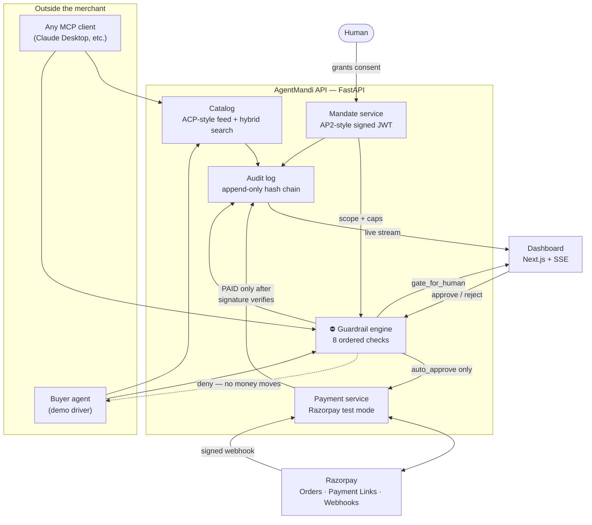

# AgentMandi

**An agent commerce layer.** It takes an ordinary Razorpay test-mode merchant and makes it
discoverable and transactable by an external AI buyer agent — discovery through payment —
with every money action bounded, gated, explained, and written to a tamper-evident audit trail.

Razorpay's own pilots put conversational checkout *inside* a merchant's app. The open problem
is the other side: exposing a merchant so that **any** outside agent can shop and pay. That is
what this builds.

```
Point an MCP client at this server and it can buy from the merchant, under a mandate,
without a human touching the checkout — and without being able to exceed what the human allowed.
```

---

## The bar, and where to look

| Requirement | Where it lives | See it |
| --- | --- | --- |
| **Explainable** — every money action | `services/api/app/policy/engine.py` | `GET /intents/{id}/decision` — eight ordered checks, each with a reason |
| **Bounded** — caps enforced server-side | `services/api/app/mandate/service.py` | Mandate meters on the dashboard; a token edited to raise its own cap is refused |
| **Gated** — human in the loop | `policy/engine.py` check 8 + dashboard | Run the `human_gate` scenario, then click Approve |
| **Audit trail** — visible and tamper-evident | `services/api/app/audit/log.py` | `GET /audit/verify`; live SSE feed in the right column |
| **Graceful failure** | four separate scenarios | `budget_exceeded`, `out_of_stock`, `payment_failure`, `forged_mandate` |
| **Any agent can transact** | `services/api/app/mcp_server.py` | Seven MCP tools over the merchant's public HTTP API |

---

## Architecture



**The one invariant everything else serves:** money moves only through the payment service, and
only after the guardrail engine returns `auto_approve`. The buyer agent is treated as untrusted.
It has no path to a charge that does not pass `POST /intents` first.

---

## Quickstart

Requires Python 3.12+ and Node 20+. **No API keys are needed** — with an empty `.env` the demo
runs end to end on the built-in payment simulator and a deterministic planner.

```bash
git clone https://github.com/Ankit-Basu/AgentMandi.git && cd AgentMandi
```

**1 · API**

```bash
python -m venv .venv
```

```bash
.venv/Scripts/activate || source .venv/bin/activate
```

```bash
pip install -r services/api/requirements-dev.txt
```

```bash
cd services/api && python -m uvicorn app.main:app --reload --port 8000
```

**2 · Dashboard** (second terminal)

```bash
npm install
```

```bash
npm run dev
```

The dashboard is on <http://localhost:3000>, the API on <http://127.0.0.1:8000>, and interactive
API docs on <http://127.0.0.1:8000/docs>.

On first boot the API creates its SQLite database and ingests the 33-product seed catalog.

---

## Demo script — under three minutes

Hit **Reset demo** in the dashboard header first, so the audit trail starts clean.

### Happy path (~45s)

1. **Grant a mandate** in the Buyer agent panel — ₹3,000 per purchase, ₹10,000 total,
   electronics and office only. This is the human consent step; the agent cannot mint one.
2. Type **`buy a wireless mouse under 1500`** and hit Run.
3. Watch the transcript: it searches, picks the Aurora Wireless Optical Mouse *with a stated
   reason*, raises an intent, clears all eight guardrails, opens a Razorpay order and payment
   link, and settles.
4. Open the intent in the middle column. **Every check is listed in order with its reason.**
5. The audit feed on the right filled in live, and the header says *chain intact*.

### Gated purchase (~30s)

1. Run the **High-value purchase waits for a human** scenario.
2. The agent stops. Seven checks pass; the eighth returns `gate_for_human` because ₹7,999 is
   over the ₹5,000 threshold. The mandate meter shows the money **held**, not spent.
3. Click **Approve**. Approving re-runs every other guardrail against current state — a human
   waives the threshold, not stock, category or budget.
4. Click **Pay with test card**. It settles, and the held money becomes spent.

### Graceful failure (~45s) — pick one

- **Budget exhausted** — the agent buys a mouse, then a ₹4,499 keyboard is attempted. It clears
  the per-transaction cap by ₹1 but breaches what is actually left, so `budget_remaining` denies
  it and *names the shortfall in rupees*. The agent re-searches under the remaining budget and
  buys the ₹2,499 wireless keyboard instead.
- **Card declined** — an approved purchase reaches checkout and the card is declined. The intent
  goes `FAILED` and the budget hold is **released**: a charge that did not succeed never consumes
  the buyer's budget.
- **Out of stock mid-flow** — the last unit sells to someone else between the agent's search and
  its intent. The stock guardrail refuses the sale and the agent re-plans *inside the same run*.
- **Tampered mandate** — a token edited to raise its own cap to ₹999,999 fails signature
  verification before any bound is even consulted.

### The audit trail (~20s)

```bash
curl -s http://127.0.0.1:8000/audit/verify
```

Every row is `sha256(prev_hash + canonical_json(row))`. `UPDATE` and `DELETE` on the table are
blocked by SQLite triggers, not merely by convention — and if someone goes around the application
entirely, `verify_chain()` reports the exact sequence number where the chain breaks.

---

## Any agent can buy: the MCP server

This is the strongest proof that the merchant is genuinely open to outside agents. The MCP
server is a thin adapter over the merchant's **public HTTP API** rather than an in-process
shortcut, which is how a merchant would actually ship it.

Add to your MCP client config (`claude_desktop_config.json` or equivalent):

```json
{
  "mcpServers": {
    "agentmandi": {
      "command": "D:\\AgentMandi\\.venv\\Scripts\\python.exe",
      "args": ["-m", "app.mcp_server"],
      "cwd": "D:\\AgentMandi\\services\\api",
      "env": { "AGENTMANDI_API_URL": "http://127.0.0.1:8000" }
    }
  }
}
```

| Tool | What it does |
| --- | --- |
| `search_catalog` | Natural-language search with a hard price ceiling in paise |
| `get_product` | Full typed record for one product |
| `create_purchase_intent` | **Runs every guardrail.** Returns `auto_approve` / `gate_for_human` / `deny` with each check and its reason |
| `confirm_purchase` | Opens a Razorpay order and payment link — refuses anything not `APPROVED` |
| `get_merchant_info` | How to buy here, for an agent arriving cold |
| `check_mandate` | Remaining budget, so an agent can bound its search before it shops |
| `check_intent` | Current status of an intent — did the payment actually settle? |

Get a mandate token to hand the agent:

```bash
curl -s -X POST http://127.0.0.1:8000/demo/mandate -H "Content-Type: application/json" -d "{}"
```

Then ask your agent: *"Using the agentmandi tools, buy me a wireless mouse under ₹1,500."*
It will discover, price, ask permission, and pay — and it will be refused if it strays outside
what the mandate allows.

---

## The guardrail engine

`evaluate(context) -> Decision` is a **pure function**: no database, no network. That is what
makes each check unit-testable in isolation and makes any decision reproducible from its audit
payload alone.

| # | Check | Fails when |
| --- | --- | --- |
| 1 | `mandate_valid` | Signature, issuer, expiry or revocation fails |
| 2 | `merchant_match` | The mandate names a different merchant |
| 3 | `product_exists` | Unknown product, bad quantity, or **the amount does not match the catalog price** |
| 4 | `category_allowed` | Category is outside the mandate's allow-list |
| 5 | `per_txn_cap` | This purchase exceeds the per-transaction cap |
| 6 | `budget_remaining` | It exceeds budget minus spend minus in-flight holds |
| 7 | `stock_available` | The merchant cannot actually fulfil it |
| 8 | `high_value_gate` | ≥ the threshold → `gate_for_human`, **not** a denial |

Checks run in order; the first failure denies and the rest are recorded as `skipped` rather than
silently dropped, so the trail shows exactly how far evaluation got and why it stopped.

Two design points worth pausing on:

- **Check 3 refuses an agent-supplied price.** The merchant prices the order, never the buyer.
- **The mandate token is *scope*, never *state*.** Caps and categories are signed into it; how
  much has been spent lives server-side only. A holder who edits their own "remaining budget"
  changes nothing.

### Reserve → settle | release

Budget is **held** the moment an intent is approved or gated, and converted to spend only by a
signature-verified webhook. A failed payment *releases* the hold. This is why the declined-card
scenario can prove the budget was never consumed, and why two agents racing for the last rupee
cannot both win — the availability test lives in the SQL `WHERE` clause.

---

## Payments

Razorpay **test mode only**. `config.Settings` refuses any key that does not start with
`rzp_test_`, so this cannot be pointed at real money.

With no keys configured, a local simulator mints Razorpay-shaped identifiers, serves a checkout
page at `/payments/simulator/{link_id}`, and **signs its webhooks with the same HMAC-SHA256
scheme Razorpay uses**. The verification path is genuinely exercised either way — the code that
consumes a webhook does not know which gateway produced it, and cannot be told to skip the check.

To use real Razorpay test mode, set `RAZORPAY_KEY_ID`, `RAZORPAY_KEY_SECRET` and
`RAZORPAY_WEBHOOK_SECRET`; the simulator disables itself automatically. Expose the webhook
endpoint (e.g. `ngrok http 8000` → point the Razorpay webhook at `/payments/webhook`) and
subscribe to `payment_link.paid`, `payment.captured`, `payment.failed` and `order.paid`.

An intent becomes `PAID` **only** inside the webhook handler, after HMAC-SHA256 over the raw
body matches `X-Razorpay-Signature`. A client claiming "I paid, honest" gets a rejected-webhook
audit row and nothing else.

---

## Tests

```bash
cd services/api && python -m pytest
```

103 tests: every guardrail check in isolation, mandate signing and four flavours of tamper
rejection, budget reserve/settle/release including a concurrency race, webhook signature
verification, audit-chain tamper evidence, and the agent's recovery behaviour.

---

## Layout

```
apps/web/                 Next.js dashboard — live audit stream, HITL gate, budget meters
packages/shared-types/    zod mirrors of the Pydantic models
seed/products.json        33 deterministic products across 4 categories
seed/scenarios.json       7 demo scenarios: narrative, expectations, what to watch for
services/api/app/
  catalog/                ingest, embeddings, hybrid BM25 + vector search
  mandate/                signed JWT mandates + budget accounting
  policy/engine.py        the guardrail engine
  payments/               Razorpay gateway, simulator, webhook settlement
  intents/                the only route from "agent wants to buy" to "money moves"
  audit/                  hash-chained log + SSE broadcaster
  agent/                  buyer agent + provider-agnostic LLM wrapper
  mcp_server.py           MCP tools for any external agent
```

---

## Configuration

Every value has a working default; see [`.env.example`](.env.example). The ones that matter:

| Variable | Default | Notes |
| --- | --- | --- |
| `MANDATE_JWT_SECRET` | dev default | **Change it.** Anyone holding it can mint spending authority. `/health` warns while it is unset. |
| `HITL_THRESHOLD_PAISE` | `500000` | ₹5,000. Purchases at or above this are held for a human. |
| `RAZORPAY_KEY_ID` / `_SECRET` | empty | Empty → simulator. Must be `rzp_test_*`. |
| `LLM_PROVIDER` | `auto` | First provider with a key, else a deterministic planner. |
| `GEMINI_API_KEY` / `GROQ_API_KEY` | empty | Free tiers. Either one drives the agent's product choice. |
| `EMBEDDINGS_BACKEND` | `hashing` | Deterministic and dependency-free. `sentence-transformers` swaps in dense vectors. |

### Two deliberate substitutions

Both keep the demo reproducible on any machine with no network and no keys, and both are one
environment variable away from the "real" thing:

- **SQLite instead of hosted Postgres + pgvector.** No cold start, no network, and the schema is
  plain readable SQL. Vectors are stored as blobs and searched by cosine similarity in numpy;
  on a 33-item catalog this is indistinguishable in behaviour and considerably easier to audit.
- **A deterministic hashing embedder instead of `sentence-transformers`.** No 2 GB torch
  download, identical vectors on every machine. Retrieval is hybrid either way — BM25 carries
  most of the signal at this catalog size, and dense vectors mainly help with paraphrase.
  `EMBEDDINGS_BACKEND=sentence-transformers` switches to `all-MiniLM-L6-v2` with no other change.

Search quality is not hand-waved: `buy a wireless mouse under 1500` parses the ceiling into a
hard filter and ranks the right mouse first; `something to raise my laptop` finds the laptop
stand. A small domain lexicon widens buyer phrasing ("earbuds" → "earphones") and is applied to
queries only, never to stored product text, so it cannot invent a product that does not exist.

---

## What this is not

- **Not crypto rails.** No x402, no MPP. The conventions borrowed are ACP's agent-readable feed
  and checkout intent, and AP2's signed mandate encoding scope, caps and expiry.
- **Not NPCI's Unified Agent Protocol.** UAP is not live. Its *pattern* — one-time human consent
  plus per-merchant spending limits, so an agent transacts without a PIN or OTP each time — is
  implemented here as our own signed mandate, with no dependency on the unreleased protocol.
- **Not handling real money.** Test mode only, enforced in config.
